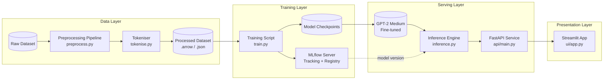
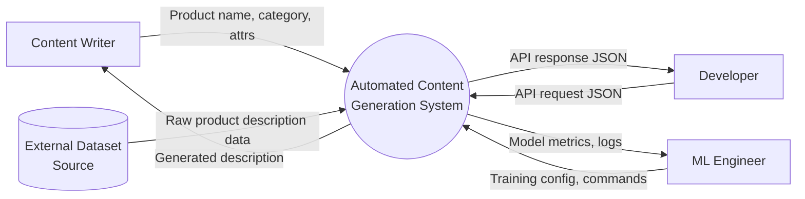
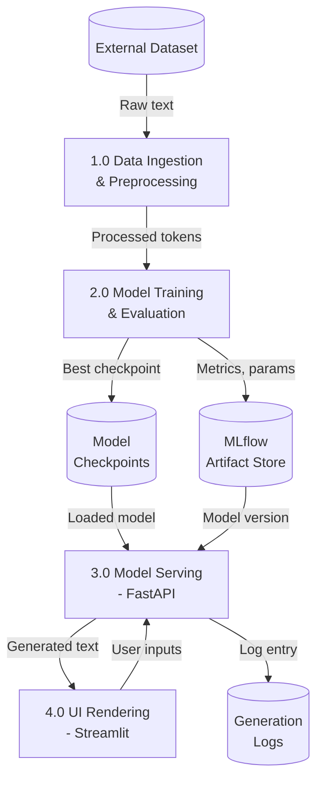
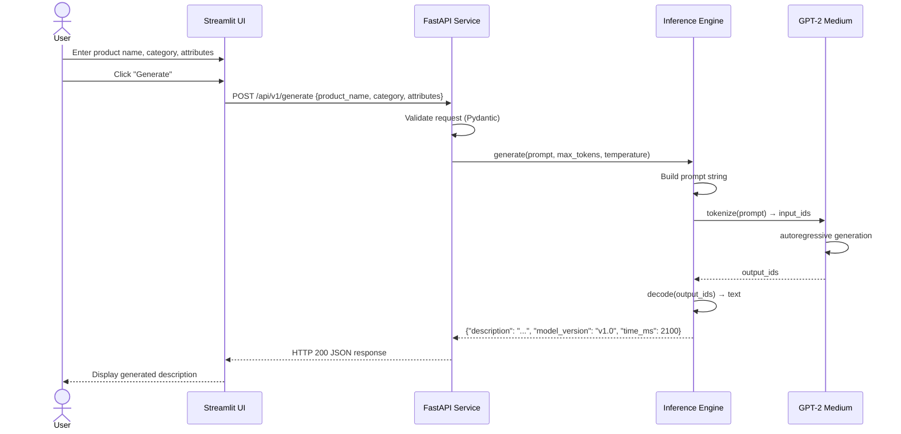
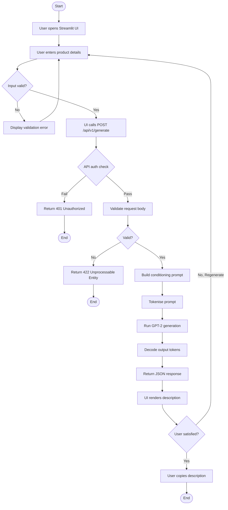
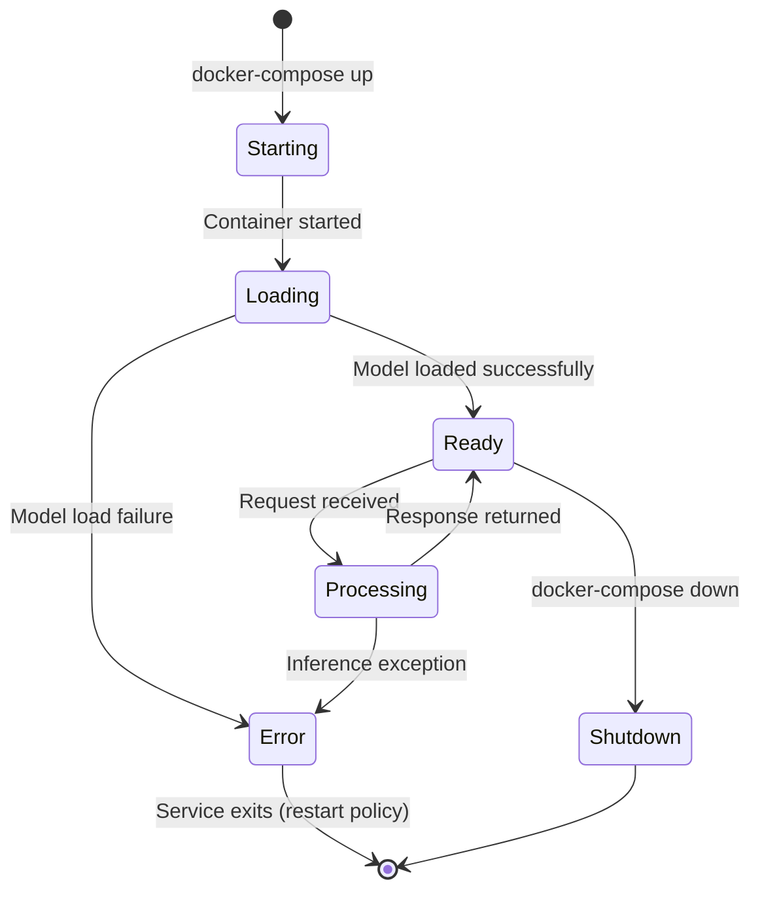
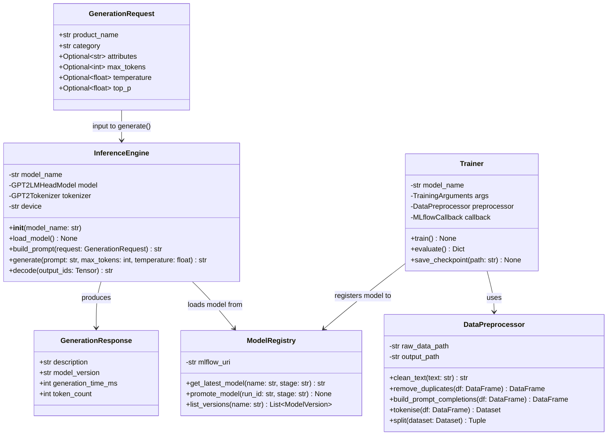
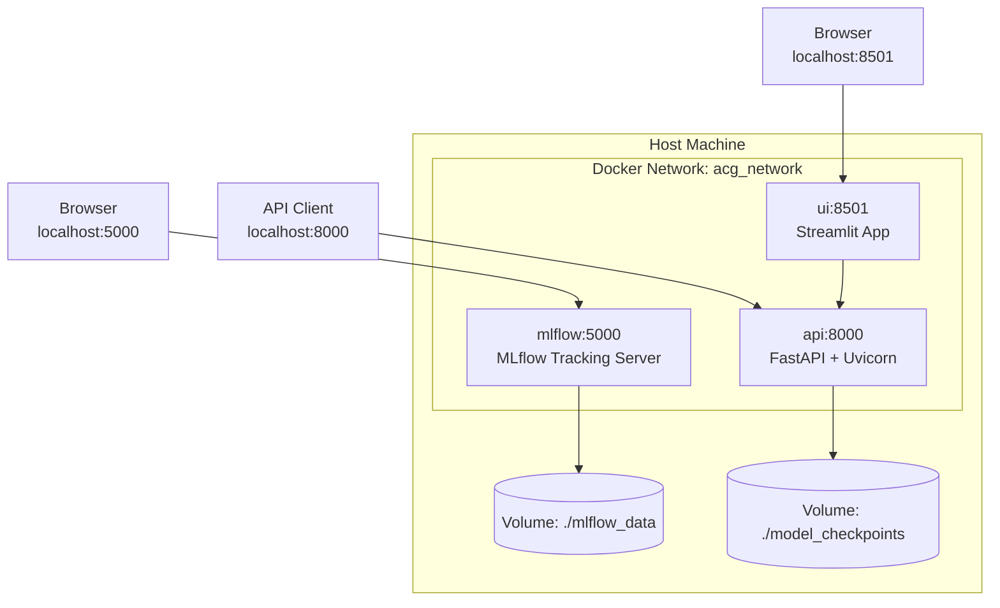

# 09 — System Analysis & Design

**Project Title:** Automated Content Generation System for E-Commerce Product Descriptions
**Document Type:** System Analysis & Design
**Version:** 1.0

---

## 1. Problem Statement & Objectives

### 1.1 Problem Statement

E-commerce organisations must maintain product catalogues containing thousands of items, each requiring a unique, accurate, and engaging written description. Manual content production is costly, slow, and difficult to scale. Existing template-based solutions generate repetitive, low-quality text. The central problem this system addresses is:

> **How can an AI-powered pipeline automatically generate high-quality, domain-specific product descriptions from structured product attributes, at scale and with minimal human intervention?**

### 1.2 System Objectives

1. Accept structured product inputs (name, category, attributes) from a UI or REST API.
2. Generate coherent, commercially appropriate product descriptions using a fine-tuned GPT-2 Medium language model.
3. Provide experiment tracking, model versioning, and reproducible training via MLflow.
4. Expose generation capabilities via a documented REST API (FastAPI).
5. Offer an interactive user interface (Streamlit) for non-technical content creators.
6. Compare Transformer-based and GAN-based generation empirically within the same evaluation framework.

---

## 2. System Actors and Use Case Diagram

### 2.1 System Actors

| Actor | Description |
|-------|-------------|
| Content Writer | Non-technical user who interacts with the Streamlit UI to generate descriptions |
| Developer | External system or developer consuming the FastAPI REST API |
| ML Engineer | Internal user who trains, evaluates, and manages models via the CLI and MLflow |
| System Administrator | Deploys, monitors, and maintains the containerised infrastructure |

### 2.2 Textual Use Case Diagram Description

The system has four primary actors interacting with three main subsystems:

- **Content Writer → Streamlit UI** (UC-01, UC-03, UC-04, UC-11)
- **Developer → FastAPI REST Service** (UC-02, UC-04, UC-07, UC-12)
- **ML Engineer → Training Pipeline + MLflow** (UC-05, UC-06, UC-08, UC-09, UC-10)
- **System Administrator → Docker Infrastructure** (UC-07)

### 2.3 Mermaid Use Case Diagram

```mermaid
graph TD
    CW[Content Writer]
    DEV[Developer]
    MLE[ML Engineer]
    SA[System Admin]

    subgraph Streamlit UI
        UC01[UC-01: Generate Description via UI]
        UC03[UC-03: Regenerate Description]
        UC04a[UC-04: Adjust Parameters - UI]
    end

    subgraph FastAPI REST Service
        UC02[UC-02: Generate via API]
        UC04b[UC-04: Adjust Parameters - API]
        UC07[UC-07: Monitor Health]
        UC12[UC-12: Authenticate]
    end

    subgraph Training Pipeline + MLflow
        UC05[UC-05: View Experiment Logs]
        UC06[UC-06: Register Model]
        UC08[UC-08: Run Training Pipeline]
        UC09[UC-09: View Attention Visualisation]
        UC10[UC-10: Compare Models]
    end

    CW --> UC01
    CW --> UC03
    CW --> UC04a
    DEV --> UC02
    DEV --> UC04b
    DEV --> UC07
    DEV --> UC12
    SA --> UC07
    MLE --> UC05
    MLE --> UC06
    MLE --> UC08
    MLE --> UC09
    MLE --> UC10
```



---

## 3. Functional & Non-Functional Requirements Summary

> Full requirements are documented in `08_requirements_gathering.md`. Key requirements are summarised here for design traceability.

**Core Functional Requirements (Must Have):**
- FR-01 to FR-05: Data pipeline and preprocessing
- FR-06 to FR-10: Model training and MLflow integration
- FR-13, FR-14, FR-16: Evaluation
- FR-17 to FR-21, FR-23: REST API
- FR-24, FR-25, FR-29: Streamlit UI
- FR-30 to FR-32: MLOps and containerisation

**Core Non-Functional Requirements:**
- API P95 latency ≤ 5 seconds (NFR-P01)
- Stateless API enabling horizontal scaling (NFR-S01)
- ≥ 80% unit test coverage (NFR-R04)
- Docker-based portability (NFR-PO01)

---

## 4. Software Architecture

### 4.1 Architectural Style

The system follows a **three-tier, microservice-inspired architecture** with the following layers:

1. **Data & Model Tier:** Offline data processing and model training pipeline; persists artefacts to disk and MLflow.
2. **Service Tier:** FastAPI REST service that loads the trained model and serves inference requests.
3. **Presentation Tier:** Streamlit web application that communicates with the Service Tier via HTTP.

This architecture separates concerns clearly: the training pipeline can be updated and re-run independently of the serving infrastructure, and the UI is decoupled from the inference logic via the REST API.

### 4.2 High-Level Architecture Diagram



### 4.3 Component Descriptions

| Component | Technology | Responsibility |
|-----------|-----------|----------------|
| Preprocessing Pipeline | Python, Pandas, NLTK | Clean, normalise, and structure raw text data |
| Tokeniser | Hugging Face `GPT2Tokenizer` | Convert text to token IDs for model input |
| Training Script | PyTorch, Hugging Face `Trainer` | Fine-tune GPT-2 Medium; log to MLflow |
| MLflow Server | MLflow OSS | Track experiments; register model versions |
| FastAPI Service | FastAPI, Uvicorn | Expose REST endpoints; route requests to inference engine |
| Inference Engine | Hugging Face `pipeline` / manual | Load model; generate text from prompt |
| Streamlit App | Streamlit | Render UI; call API; display results |
| Docker Compose | Docker | Orchestrate all services as containers |

---

## 5. Database Design & Data Modelling

### 5.1 Data Entities

The system does not use a traditional relational database for runtime operations (stateless API). The persistent data stores are:

**Entity 1: ProductDescriptionRecord (training data)**

| Field | Type | Description |
|-------|------|-------------|
| `record_id` | STRING (PK) | Unique identifier (UUID or hash of title+category) |
| `product_name` | STRING | Name of the product |
| `category` | STRING | Product category (Electronics, Clothing, etc.) |
| `attributes` | JSON / TEXT | Key-value pairs of product features |
| `description` | TEXT | Human-written product description (ground truth) |
| `source` | STRING | Dataset source identifier |
| `split` | ENUM (train/val/test) | Dataset split assignment |
| `token_count` | INTEGER | Number of GPT-2 tokens in the description |
| `created_at` | DATETIME | Record creation timestamp |

**Entity 2: MLflowExperimentRun (managed by MLflow)**

| Field | Type | Description |
|-------|------|-------------|
| `run_id` | STRING (PK) | MLflow-generated run identifier |
| `experiment_name` | STRING | Experiment grouping name |
| `model_name` | STRING | e.g., "gpt2-medium", "distilgpt2", "seqgan" |
| `learning_rate` | FLOAT | Logged hyperparameter |
| `batch_size` | INTEGER | Logged hyperparameter |
| `num_epochs` | INTEGER | Logged hyperparameter |
| `train_perplexity` | FLOAT | Final training perplexity |
| `val_perplexity` | FLOAT | Final validation perplexity |
| `bleu_score` | FLOAT | BLEU-4 score on test set |
| `artefact_path` | STRING | Path to model checkpoint artefact |
| `status` | ENUM | Staging / Production / Archived |

**Entity 3: GenerationLog (optional, for API logging)**

| Field | Type | Description |
|-------|------|-------------|
| `log_id` | STRING (PK) | UUID |
| `request_id` | STRING | Unique request identifier |
| `product_name` | STRING | Input product name |
| `category` | STRING | Input category |
| `attributes` | JSON | Input attributes |
| `generated_text` | TEXT | Output description |
| `model_version` | STRING | Model used for generation |
| `generation_time_ms` | INTEGER | Time taken for inference |
| `timestamp` | DATETIME | Request timestamp |

### 5.2 ER Diagram (Textual)

```
ProductDescriptionRecord
    ├── record_id (PK)
    ├── product_name
    ├── category
    ├── attributes
    ├── description
    ├── source
    ├── split
    ├── token_count
    └── created_at

MLflowExperimentRun (managed by MLflow)
    ├── run_id (PK)
    ├── experiment_name
    ├── model_name
    ├── [hyperparameters...]
    ├── [metrics...]
    └── artefact_path

GenerationLog (optional)
    ├── log_id (PK)
    ├── request_id
    ├── [input fields...]
    ├── generated_text
    ├── model_version
    └── timestamp
```

### 5.3 Logical Schema (Processed Dataset — Parquet / JSONL)

```json
{
  "record_id": "a3f2c1d9",
  "prompt": "Product: Wireless Bluetooth Headphones | Category: Electronics | Description:",
  "completion": "Experience premium sound quality with our Wireless Bluetooth Headphones. Featuring 30-hour battery life and active noise cancellation...",
  "token_count": 142,
  "split": "train"
}
```

---

## 6. Data Flow & System Behaviour

### 6.1 DFD — Context Level (Level 0)



### 6.2 DFD — Level 1



### 6.3 Sequence Diagram — API Generation Request



### 6.4 Activity Diagram — Content Generation Flow



### 6.5 State Diagram — FastAPI Service Lifecycle



### 6.6 Class Diagram — Core Backend Components



---

## 7. UI/UX Design & Prototyping

### 7.1 Main Screens

| Screen | Description |
|--------|-------------|
| **Home / Generator Screen** | Primary screen; contains input form and generated output display |
| **Settings Panel** | Sidebar with advanced generation parameters (temperature, top-p, max tokens) |
| **About / Help Screen** | Brief description of the system, model, and usage instructions |

### 7.2 Wireframe — Home / Generator Screen (Text Description)

```
+----------------------------------------------------------+
|  🤖 AI Product Description Generator         [Settings]  |
+----------------------------------------------------------+
|                                                          |
|  Product Name: [________________________]                |
|                                                          |
|  Category:     [Electronics ▼          ]                |
|                                                          |
|  Key Features: [________________________]                |
|                (Optional, comma-separated)               |
|                                                          |
|  [  Generate Description  ]   [  Clear  ]               |
|                                                          |
| ─────────────────────────────────────────────────────── |
|  Generated Description:                                  |
|  +----------------------------------------------------+  |
|  | Experience premium sound quality with our         |  |
|  | Wireless Bluetooth Headphones. Featuring 30-hour  |  |
|  | battery life and active noise cancellation, these |  |
|  | headphones deliver an immersive listening         |  |
|  | experience...                                     |  |
|  +----------------------------------------------------+  |
|                                                          |
|  [  📋 Copy to Clipboard  ]  [  🔄 Regenerate  ]        |
|                                                          |
|  Model: gpt2-medium-v1.2  |  Time: 2.3s  | Tokens: 118  |
+----------------------------------------------------------+
```

### 7.3 Wireframe — Settings Sidebar

```
+----------------------------+
| ⚙️ Generation Settings     |
|                            |
| Temperature:               |
| [====●=========] 0.8       |
|                            |
| Top-p (nucleus):           |
| [=========●====] 0.9       |
|                            |
| Max Tokens:                |
| [  150  ] (50–300)         |
|                            |
| Repetition Penalty:        |
| [  1.2  ]                  |
|                            |
| [  Reset to Defaults  ]    |
+----------------------------+
```

### 7.4 UI/UX Guidelines

**Simplicity:** The primary screen presents exactly the information a content writer needs — three input fields and one button — without overwhelming the user with technical options. Advanced settings are hidden in a collapsible sidebar.

**Accessibility:** All interactive elements shall have descriptive ARIA labels. Colour contrast shall comply with WCAG 2.1 AA standards (contrast ratio ≥ 4.5:1 for normal text). The UI shall be navigable via keyboard.

**Responsiveness:** Streamlit's columnar layout system shall be used to ensure readability on screens from 1024px width upward. On narrower screens, the layout collapses to a single-column view.

**Consistency:** All buttons use the same visual style (primary action: blue; secondary: grey). Typography uses a single sans-serif font family throughout. Error messages appear in red inline text, not alert pop-ups.

**Feedback:** A spinner is displayed during generation. Successful generation clears the spinner and renders the text with a subtle fade-in. Errors display a friendly message with a suggested action.

---

## 8. System Deployment & Integration

### 8.1 Technology Stack

| Layer | Technology | Version |
|-------|-----------|---------|
| Language | Python | 3.10+ |
| Deep Learning | PyTorch | 2.x |
| Model Library | Hugging Face Transformers | 4.40+ |
| API Framework | FastAPI | 0.111+ |
| ASGI Server | Uvicorn | 0.29+ |
| UI Framework | Streamlit | 1.35+ |
| Experiment Tracking | MLflow | 2.12+ |
| Data Processing | Pandas | 2.x |
| NLP Preprocessing | NLTK, spaCy | Latest stable |
| Containerisation | Docker, Docker Compose | 24.x / 2.x |
| Testing | pytest, httpx | Latest stable |
| Metrics | sacrebleu, evaluate | Latest stable |
| Orchestration (opt.) | Apache Airflow | 2.9+ |

### 8.2 Deployment Architecture (Text Description)

The system consists of three containerised services managed by Docker Compose:

1. **`mlflow` service:** Runs the MLflow tracking server on port 5000. Mounts a local volume for artefact storage (`./mlflow_data`).
2. **`api` service:** Runs the FastAPI/Uvicorn server on port 8000. Mounts the model checkpoint directory. Depends on `mlflow` service being healthy.
3. **`ui` service:** Runs the Streamlit application on port 8501. Communicates with the `api` service via Docker internal network. Exposes only port 8501 to the host.

### 8.3 Deployment Diagram (Mermaid)



### 8.4 Component Diagram (Text Description)

```
+-------------------+     HTTP      +-------------------+
|   Streamlit UI    | ────────────► |  FastAPI Service  |
|   (ui/app.py)     |               |  (api/main.py)    |
+-------------------+               +--------+----------+
                                             |
                                             | loads
                                             ▼
                                    +-------------------+
                                    | Inference Engine  |
                                    | (inference.py)    |
                                    +--------+----------+
                                             |
                                             | loads weights
                                             ▼
                                    +-------------------+
                                    | GPT-2 Medium      |
                                    | (HuggingFace)     |
                                    +-------------------+
                                             
                                    +-------------------+
                                    | MLflow Server     |◄── Training Pipeline
                                    | (model registry)  |
                                    +-------------------+
```

---

## 9. API Documentation Draft

### 9.1 Base URL

```
http://localhost:8000
```

### 9.2 Authentication

All `/api/v1/` endpoints require an API key passed as a Bearer token:

```
Authorization: Bearer <API_KEY>
```

### 9.3 Endpoints

**POST `/api/v1/generate`** — Generate a product description

Request:
```json
{
  "product_name": "Wireless Bluetooth Headphones",
  "category": "Electronics",
  "attributes": "noise cancellation, 30-hour battery, foldable design",
  "max_tokens": 150,
  "temperature": 0.8,
  "top_p": 0.9
}
```

Response (200 OK):
```json
{
  "description": "Experience premium audio with our Wireless Bluetooth Headphones. Engineered for the modern listener, these headphones combine active noise cancellation with an impressive 30-hour battery life, ensuring uninterrupted sound throughout your day. The foldable design makes them perfectly portable, whether you are commuting, travelling, or working from home.",
  "model_version": "gpt2-medium-v1.2",
  "generation_time_ms": 2140,
  "token_count": 68
}
```

Response (422 Unprocessable Entity):
```json
{
  "detail": [
    {
      "loc": ["body", "product_name"],
      "msg": "field required",
      "type": "value_error.missing"
    }
  ]
}
```

---

**GET `/health`** — System health check

Response (200 OK):
```json
{
  "status": "ok",
  "model_loaded": true,
  "model_version": "gpt2-medium-v1.2",
  "uptime_seconds": 3612
}
```

Response (503 Service Unavailable — model loading):
```json
{
  "status": "starting",
  "model_loaded": false
}
```

---

**GET `/api/v1/models`** — List available model versions

Response (200 OK):
```json
{
  "models": [
    {
      "name": "product-description-gpt2",
      "version": "3",
      "stage": "Production",
      "run_id": "a1b2c3d4",
      "metrics": {
        "val_perplexity": 24.3,
        "bleu_4": 18.7
      }
    },
    {
      "name": "product-description-gpt2",
      "version": "2",
      "stage": "Staging",
      "run_id": "e5f6g7h8",
      "metrics": {
        "val_perplexity": 27.1,
        "bleu_4": 16.2
      }
    }
  ]
}
```

---

## 10. Testing & Validation Plan

### 10.1 Testing Levels

| Level | Scope | Tools |
|-------|-------|-------|
| Unit Testing | Individual functions: `build_prompt`, `clean_text`, `decode` | `pytest` |
| Integration Testing | API endpoints with loaded model | `pytest` + `httpx` |
| System Testing | End-to-end: UI → API → Model → Response | Manual + `pytest` |
| Performance Testing | API latency under load | `locust` |
| Model Evaluation | Perplexity, BLEU on test set | `evaluate`, `sacrebleu` |
| Human Evaluation | Fluency, relevance, usability | Survey form |

### 10.2 Test Cases (Sample)

| TC ID | Test Name | Input | Expected Output | Pass Criterion |
|-------|-----------|-------|-----------------|----------------|
| TC-01 | Valid API request | `{product_name: "Laptop", category: "Electronics"}` | HTTP 200, non-empty `description` string | Status 200, description length > 20 chars |
| TC-02 | Missing required field | `{category: "Electronics"}` (no `product_name`) | HTTP 422 | Status 422, error detail mentions `product_name` |
| TC-03 | Health check — model loaded | GET `/health` after model startup | `{"status": "ok", "model_loaded": true}` | Status 200, `model_loaded: true` |
| TC-04 | Generation time | Valid generate request | Response within 5 seconds | `generation_time_ms` ≤ 5000 |
| TC-05 | Token count within bounds | `max_tokens: 150` | Generated text ≤ 150 tokens | `token_count` ≤ 150 |
| TC-06 | Clean text function | `"<p>Great product!</p>"` | `"Great product!"` | Output equals expected string |
| TC-07 | Prompt builder | `{product_name: "Shoes", category: "Footwear"}` | `"Product: Shoes | Category: Footwear | Description:"` | Exact string match |

---

## 11. Deployment Strategy

### 11.1 Development Deployment

- All services run locally via `docker-compose up`.
- Model checkpoint loaded from `./model_checkpoints/gpt2-medium-v1/`.
- MLflow server at `http://localhost:5000`.
- FastAPI at `http://localhost:8000`.
- Streamlit at `http://localhost:8501`.

### 11.2 Demo / Presentation Deployment

- Same Docker Compose stack deployed on the presenter's laptop.
- Model pre-loaded to avoid startup delay during demonstration.
- Internet access not required (fully local).

### 11.3 Optional Cloud Deployment

| Platform | Notes |
|----------|-------|
| Hugging Face Spaces | Free Streamlit hosting; model can be loaded from Hugging Face Hub |
| Render.com | Free tier Docker web services; suitable for FastAPI |
| Google Cloud Run | Serverless containers; auto-scales; requires GCP account |

### 11.4 Deployment Checklist

- [ ] `requirements.txt` with pinned versions committed
- [ ] `Dockerfile` builds without errors on clean machine
- [ ] `docker-compose.yml` starts all services with `docker-compose up`
- [ ] `/health` endpoint returns `model_loaded: true` within 30 seconds of startup
- [ ] At least one successful end-to-end generation test performed
- [ ] MLflow model registered and loaded by API service
- [ ] API documentation accessible at `localhost:8000/docs`

---

## Notes for Customisation

- Update all `localhost` references with actual deployment domain or IP for cloud deployments.
- Replace `gpt2-medium-v1.2` with actual MLflow model version tags after training.
- Extend the class diagram with additional classes if modular components are added (e.g., a rate-limiter class, a logger class).
- Add sequence diagrams for the training pipeline workflow and the MLflow model promotion workflow if required by the supervisor.
- Expand the database design with an actual SQLite or PostgreSQL schema if generation logging is implemented.
